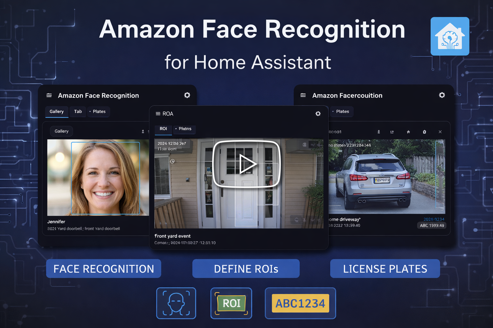
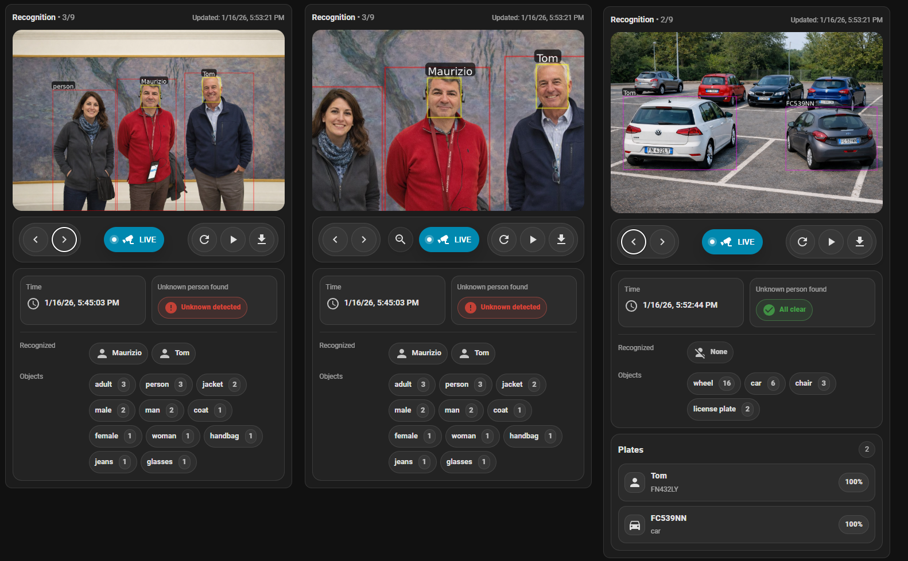

# Amazon Face Recognition for Home Assistant

## A complete AI-powered recognition ecosystem for Home Assistant
[](https://github.com/hacs/integration)
[](https://www.buymeacoffee.com/madmicio)

### Demo Video
click to play
[](https://www.youtube.com/watch?v=CgJpR0S9gEU)


**Amazon Face Recognition** is a **full-featured, production-ready recognition ecosystem** for Home Assistant, built on top of **AWS Rekognition**.

It is not just a simple integration, but a **cohesive system** composed of:

- 🧠 a **custom integration** (image processing, AWS communication, sensors & events)
- 🖥 a **dedicated Custom Control Panel** (configuration, management, ROI editor, gallery, plates)
- 🖼 a **built-in Custom Lovelace Card** (visualization and inspection)

All components are designed together to work as **one coherent platform**.

There is:
- ❌ no legacy YAML configuration  
- ❌ no manual JavaScript resources  
- ❌ no external scripts or tools  

Everything is managed **directly from the Home Assistant UI**.

---

## Core design philosophy

- **AWS Rekognition** is used as the AI engine
- **Home Assistant** is the single control point
- The **Custom Control Panel** is the source of truth
- Local data is always kept **aligned with AWS**
- The **Custom Card is read-only** and always reflects backend state
- Multilingual UI (automatically follows Home Assistant language)

This approach guarantees **consistency, reliability and long-term maintainability**.

---

## Main Features

### 👤 Face Recognition
- Face recognition using **AWS Rekognition Face Collections**
- Clear separation between **recognized** and **unrecognized** faces
- Fully visual training workflow
- Annotated snapshots with bounding boxes and labels
- Local face index synchronized with AWS at startup

---

### 🖼 Face Gallery & Management


The **Gallery** is the visual core of the ecosystem.

It provides a **real-time and historical view** of all processed images, including:
- recognized faces
- unknown faces
- detected vehicles
- license plates
- timestamps and camera source

From the Gallery you can:
- upload training images
- assign faces to identities
- delete a person or clear the entire collection
- refresh the face index

All actions are performed safely:
- AWS is updated
- local cache is updated
- UI refreshes instantly

No services or YAML are required.

---

### 🎯 ROI – Region of Interest


ROI allows you to define **specific areas of the camera image** that should be analyzed.

Key benefits:
- 🎯 focus detection only on relevant zones
- ❌ ignore background or irrelevant areas
- 📉 reduce false positives
- 💰 significantly lower AWS costs
- ⚡ improve performance

Features:
- multiple ROIs per camera
- visual ROI editor
- instant application (no restart required)
- consistent behavior across gallery, sensors and automations

If no ROI is defined, the full image is analyzed.

---

### 🚗 Vehicle & License Plate Recognition
- Vehicle detection (car, truck, motorcycle, bus)
- License plate OCR
- Plate → owner mapping
- Dedicated Plates panel
- Annotated snapshots with vehicle and plate bounding boxes

Vehicle and plate detection can be finely tuned to balance:
- accuracy
- performance
- AWS cost

---

### 🖼 Custom Lovelace Card


The **Custom Lovelace Card** is automatically available after installation.

It provides a **powerful, read-only visualization layer**:

- annotated snapshot viewer
- zoom, pan and reset
- live camera view toggle
- recognized vs unknown summary
- detected objects and vehicles
- license plates with confidence
- snapshot download

No separate installation is required:
- no JS resources to add
- no extra HACS steps

The card always reflects **exactly the same data** used by:
- the Control Panel
- the Gallery
- sensors and automations

---

## Automation-ready by design

The integration exposes multiple sensors and attributes that can be used for:

- notifications when an unknown person is detected
- alerts when a specific person appears
- vehicle or plate-based automations
- cost monitoring and usage statistics

What you see in the UI is **exactly what automations receive**.
There are no hidden detections or mismatches.

---

## Installation (HACS)

1. Open **HACS**
2. Go to **Integrations**
3. Add this repository as a **Custom Repository**
4. Search for **Amazon Face Recognition**
5. Install and restart Home Assistant

After restart:
- add the integration from **Settings → Devices & Services**
- complete the configuration wizard (AWS credentials + collection)

---

## Lovelace Card – Resource setup

Amazon Face Recognition automatically loads its frontend files at startup.
In most cases, no manual action is required.

However, due to how Home Assistant and the Companion App handle frontend caching,
some environments may fail to load the Lovelace card reliably
(e.g. after app resume or cold start).

### If the Lovelace card shows “Configuration error”

Please add the card resource manually:

1. Go to **Settings → Dashboards → Resources**
2. Add a new resource:
     ```yaml
     url: /amazon_face_recognition/frontend/aws-face-recognition-card.js
     type: module
     ```
3. Reload resources or restart Home Assistant

This makes the card fully persistent and eliminates random loading issues
in the Home Assistant Companion App.


## Documentation

📘 **Full documentation is available in the GitHub Wiki**:

👉 https://github.com/madmicio/amazon_face_recognition/wiki

The Wiki includes:
- AWS setup
- Control Panel usage
- Gallery and ROI
- Vehicles & plates
- Options reference
- Sensors & services
- Automation examples
- Troubleshooting and FAQ

---

## Disclaimer

This project is **not affiliated** with Amazon or AWS.  
Amazon Rekognition is a trademark of Amazon Web Services.
